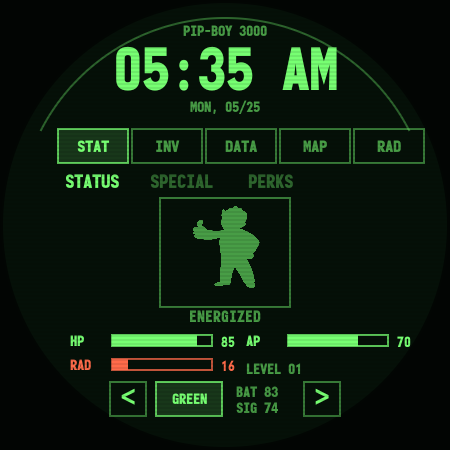
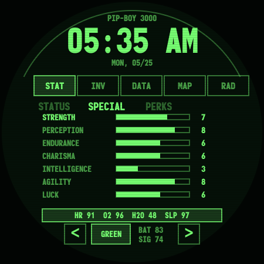
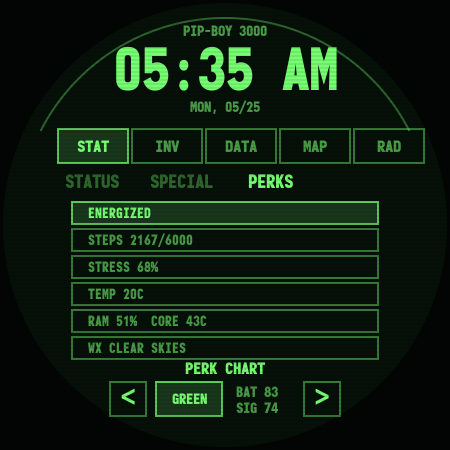
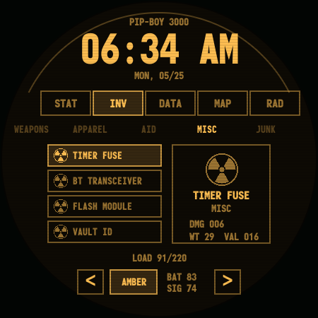
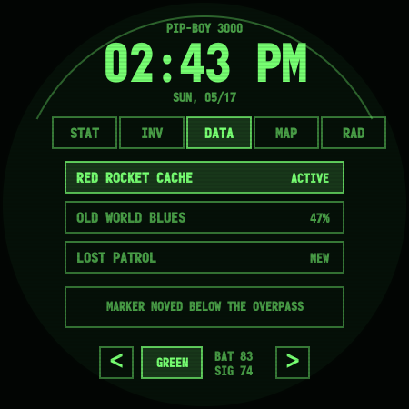
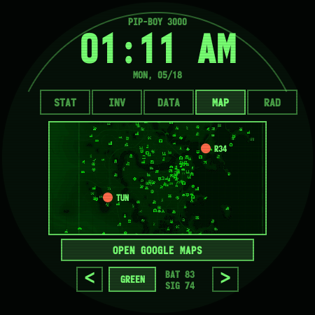
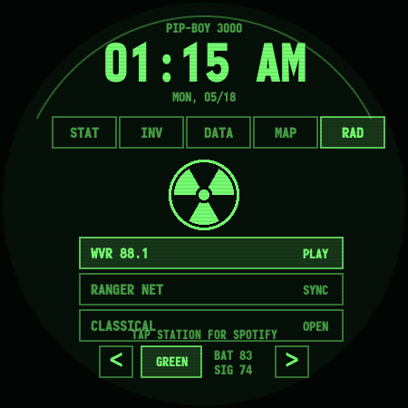

# Pip-Boy 3000 Interface for Galaxy Watch 4

A Fallout-inspired Pip-Boy interface rebuilt as a Wear OS project for the Samsung Galaxy Watch 4, with a matching browser preview. It includes a live Pip-Boy style watch face plus an interactive terminal app with STAT, INV, DATA, MAP, and RAD pages.

This is a fan-made portfolio project by Mustafa Ugur Erkan / MegaZegan. It focuses on tiny-screen UI design, round watch layouts, Canvas rendering, Wear OS packaging, retro terminal effects, and tactile Pip-Boy style interaction.

## Screenshots

| STAT / STATUS | STAT / SPECIAL | STAT / PERKS |
| --- | --- | --- |
|  |  |  |

| INV | DATA | MAP |
| --- | --- | --- |
|  |  |  |

| RAD |
| --- |
|  |

## Galaxy Watch 4 Features

- Native Wear OS APK built for Galaxy Watch 4 / Wear OS round displays.
- Pip-Boy styled watch face with live time, date, battery, and weather complication text.
- Interactive terminal app with large touch targets for the watch screen.
- Classic top navigation with `STAT`, `INV`, `DATA`, `MAP`, and `RAD`.
- STAT uses Pip-Boy style sub-pages: `STATUS`, `SPECIAL`, and `PERKS`.
- STATUS page keeps the hero Vault Boy layout with HP/AP/RAD and only the most important readouts.
- SPECIAL page carries the deeper health/survival numbers and SPECIAL bars.
- PERKS page carries status effects, lifestyle readouts, and system/weather flavor.
- INV page with randomized Fallout-style utility items, categories, values, and cosmetic carry weight.
- DATA page with randomized quest names, statuses, and notes.
- MAP page with an in-app Pip-Boy map, GPS-style readout, speed/altitude simulation, then a button to launch Google Maps.
- RAD page with in-app radio stations, signal scanner, radio noise flavor, then station taps can launch Spotify.
- Monofonto terminal typography, scanlines, glow, green/orange radiation accents, and round-screen composition.

The expanded pages are intentionally lightweight. They use simple Canvas drawing, text rows, tiny bitmap icons, low-frequency redraws, and simulated/session data instead of constant GPS, Bluetooth, sensor, or internet polling.

## Run the Browser Preview

Open `index.html` in a browser, or serve the folder:

```powershell
python -m http.server 4174
```

Then visit:

```text
http://127.0.0.1:4174
```

The watch-sized preview is:

```text
http://127.0.0.1:4174/watch.html
```

## Build the Wear OS APK

Open `watchface/` in Android Studio and build the `watchface` module.

Command-line build:

```powershell
cd watchface
.\gradlew.bat :watchface:assembleDebug
```

The debug APK will be created at:

```text
watchface/watchface/build/outputs/apk/debug/watchface-debug.apk
```

## Install on Samsung Galaxy Watch 4

On the watch, enable Developer Options, then enable Wireless debugging.

Pair and connect with ADB:

```powershell
adb pair <watch-ip>:<pairing-port>
adb connect <watch-ip>:<debug-port>
```

Install the APK:

```powershell
adb install -r watchface/watchface/build/outputs/apk/debug/watchface-debug.apk
```

After installation, long-press the current watch face on the Galaxy Watch 4 and select `VaultWatch Face`. Open the launcher app for the interactive Pip-Boy terminal.

## Project Layout

- `watch.html`, `css/watch.css`, `js/watch.js`: browser preview for the watch UI.
- `watchface/`: native Wear OS project.
- `watchface/watchface/src/main/java/.../TerminalActivity.java`: interactive Pip-Boy terminal app.
- `watchface/watchface/src/main/res/raw/watchface.xml`: Watch Face Format face definition.
- `watchface/watchface/src/main/assets/`: bundled UI assets used by the native watch app.
- `docs/screenshots/`: Galaxy Watch 4 screenshots used in this README.

## Disclaimer

This is a fan-made UI project for portfolio and learning purposes. It is not affiliated with or endorsed by Bethesda, Fallout, Vault-Tec, or RobCo.
